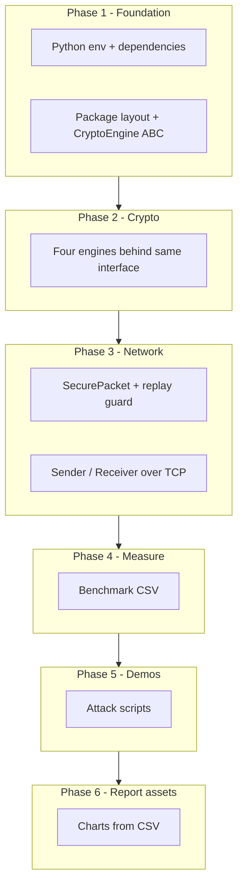
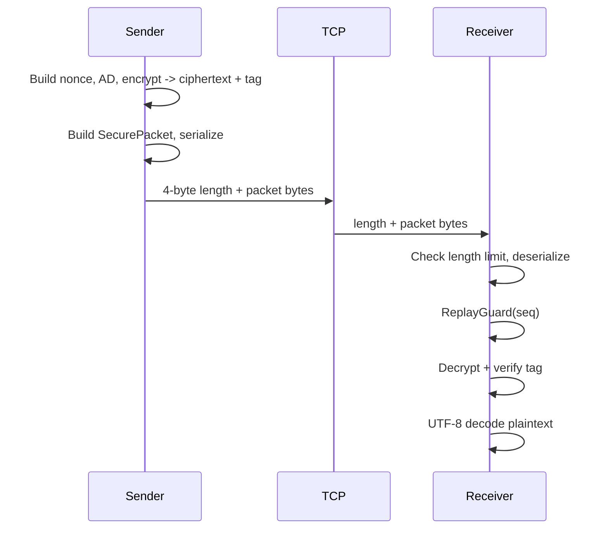

# Secure Wireless LWC — full project README

**Secure Wireless Communication using Lightweight Cryptography** — a **Python course/lab prototype** in the folder `secure-wireless-lwc-cursor`. It simulates **untrusted network transport** with **TCP** (usually localhost), encrypts messages with **ASCON** (and compares **AES-128-GCM**, **SPECK**, **PRESENT**), adds **replay protection**, and ships **benchmarks**, **charts**, and **attack demos**.

**Related docs:** [Goals, standards & sample pytest log](docs/PROJECT_GOALS_STANDARDS_AND_TEST_RESULTS.md) · [Submission checklist](docs/submission_checklist.txt) · **[Simulate client/server + attacks](docs/SIMULATION_GUIDE.md)**

---

## Table of contents

1. [What this repository is](#1-what-this-repository-is)  
2. [What we were trying to achieve](#2-what-we-were-trying-to-achieve)  
3. [Process & architecture (how we did it, not the code)](#3-process--architecture-how-we-did-it-not-the-code)  
4. [End-to-end message flow](#4-end-to-end-message-flow)  
5. [Prerequisites](#5-prerequisites)  
6. [Setup (first time)](#6-setup-first-time)  
7. [How to run the receiver (“server”) and sender (“client”)](#7-how-to-run-the-receiver-server-and-sender-client)  
8. [Other commands (benchmarks, charts, demos)](#8-other-commands-benchmarks-charts-demos)  
9. [Automated tests — how to run and what they mean](#9-automated-tests--how-to-run-and-what-they-mean)  
10. [Repository layout](#10-repository-layout)  
11. [What is intentionally not in this repo](#11-what-is-intentionally-not-in-this-repo)  
12. [Optional: packaging, CI, lint](#12-optional-packaging-ci-lint)  

---

## 1. What this repository is

| Aspect | Description |
|--------|-------------|
| **Purpose** | Demonstrate **authenticated encryption** over a **byte stream**, benchmark **four algorithms**, and **show** eavesdrop/replay/tamper outcomes for a **report**. |
| **“Wireless” here** | **Logical** wireless: we assume the channel is **not trustworthy** (like radio). Physically we use **TCP/IP** so you can run everything on one PC or two machines on a LAN. |
| **Crypto star** | **ASCON** via the official-style PyPI package `ascon` (NIST LWC / SP 800-232 context from your course materials). |
| **Comparators** | **AES-128-GCM** (PyCryptodome); **SPECK-128/128 + CTR + HMAC**; **PRESENT-80 + CTR + HMAC** (educational compositions). |
| **Protocol** | Custom binary **`SecurePacket`** + **4-byte big-endian length prefix** per TCP connection (one message per connection in the default CLI). |
| **Keys** | **Pre-shared key (PSK)** — same raw bytes on sender and receiver (`keygen` / `key_manager`). No TLS, no PKI, no ECDH in this repo. |
| **Tests** | **32** `pytest` cases covering crypto, packet format, replay logic, TCP integration, benchmarks, charts, utils, and one DoS-style limit. |
| **Course source** | Parent folder Word docs: `Phased_Development_Plan_LWC.docx`, `Secure_Wireless_Communication_LWC_Project_Doc.docx`. |

This repo is **not** a certified product, **not** ESP32 firmware, and **not** a published IoT industry standard (e.g. DTLS + MQTT). It is a **complete software pipeline** for learning and evaluation.

---

## 2. What we were trying to achieve

1. **Security story:** Confidentiality + integrity for message bodies; **metadata** in the packet header is visible on the wire (that is normal — protection is encryption + AEAD binding).  
2. **Replay story:** Re-sending the **same** bytes should not create a second valid “new” action — we use **sequence numbers** + a **sliding-window replay guard**.  
3. **Comparison story:** Same code path, same payload sizes, **CSV + plots** so you can argue ASCON vs AES vs lightweight alternatives in your **written report**.  
4. **Evidence story:** Runnable **demos**, **pytest** for regression, optional **CI** on GitHub.  
5. **Human deliverables:** **Report + slides** live **outside** this repo (Word/PowerPoint).

---

## 3. Process & architecture (how we did it, not the code)

### 3.1 Process: six phases, bottom-up

We followed the **phased development plan** from your coursework: each phase has a **clear exit** before the next layer depends on it.



**Why this order?**

1. **Foundation first** — If imports and ASCON fail, nothing else is trustworthy.  
2. **Cryptography before sockets** — You must trust encrypt/decrypt **in isolation** (unit tests) before debugging the network.  
3. **Protocol after crypto** — The packet format only makes sense once you know what each algorithm needs (nonce, AD, tag layout).  
4. **Benchmarks after correctness** — Measuring wrong code is useless.  
5. **Demos after protocol** — Attacks are scripted **uses** of sender/receiver behavior.  
6. **Charts last** — They consume **CSV** produced by benchmarks.

### 3.2 Architecture: three conceptual layers

| Layer | Responsibility | Main idea |
|-------|----------------|-----------|
| **Security / crypto** | Turn `(key, nonce, AD, plaintext)` into `(ciphertext, tag)` and back | **Pluggable engines** (`CryptoEngine`) so benchmarks swap algorithms without rewriting the network. |
| **Protocol** | Framing, versioning, algorithm id, replay state | **`SecurePacket`** is the contract between sender and receiver; **length prefix** defines message boundaries on TCP. |
| **Transport** | Reliable byte delivery | **TCP** (localhost or LAN). Not UDP in the default path. |
| **Evaluation** | Numbers for the report | **bench_runner** + **visualize** + optional **attack logs**. |

**Design choice:** Separate **“math”** (engines) from **“wire format”** (packet) from **“I/O”** (send/recv). That is how you keep the project understandable and testable.

---

## 4. End-to-end message flow



**Statuses you may see** (receiver): `OK`, `REPLAY_REJECTED`, `AUTH_FAILURE`, `PARSE_ERROR`, `LENGTH_REJECTED`, `DECODE_ERROR`, `IO_ERROR`.

---

## 5. Prerequisites

- **Python 3.10+** (project tested on **3.12**).  
- **pip**, **venv**.  
- **Windows PowerShell** examples below; on macOS/Linux use `source venv/bin/activate` instead of `.\venv\Scripts\Activate.ps1`.

---

## 6. Setup (first time)

From the **project root** (`secure-wireless-lwc-cursor`):

**Windows — automated (recommended):**

```powershell
cd path\to\secure-wireless-lwc-cursor
.\setup.ps1
```

**Manual:**

```powershell
cd path\to\secure-wireless-lwc-cursor
python -m venv venv
.\venv\Scripts\Activate.ps1
pip install -r requirements.txt
python verify_setup.py
```

**Important:** Run `main.py`, `pytest`, and demos with the **venv** Python (`.\venv\Scripts\python.exe` or after `Activate.ps1`). Using plain `python` may point at a global install **without** `pycryptodome` → `No module named 'Crypto'`.

If you open this folder in **VS Code / Cursor**, `.vscode/settings.json` selects the venv interpreter automatically.

You should see: `ALL IMPORTS OK. ASCON encrypt/decrypt VERIFIED.`

**Optional — install as a package (editable):**

```powershell
pip install -e .
```

**Confirm import:**

```powershell
python -c "from src.crypto.base_engine import CryptoEngine; print('OK')"
```

---

## 7. How to run the receiver (“server”) and sender (“client”)

The receiver **listens on a TCP port** (like a tiny server). The sender **connects** and sends **one encrypted message** per run (default CLI).

### Step A — create a shared secret key file (once)

```powershell
python main.py keygen --out keys\psk.bin
```

(`keys/` is gitignored — do not commit real keys.)

### Step B — terminal 1: start the receiver

**One message then exit:**

```powershell
python main.py serve -p 9000 --key keys\psk.bin --once
```

**Keep accepting messages until Ctrl+C:**

```powershell
python main.py serve -p 9000 --key keys\psk.bin
```

**Algorithm:** default is `ascon`. Same on both sides:

```powershell
python main.py serve -p 9000 --key keys\psk.bin --engine ascon --once
```

Choices: `ascon`, `aes`, `speck`, `present`.

**Quiet mode** (no `[RECEIVER]` lines): add `--quiet`.

### Step C — terminal 2: send a message

```powershell
python main.py send -p 9000 --key keys\psk.bin -m "Hello, secure world"
```

Optional: `--host 127.0.0.1` (default), `--device SENDER01`, `--engine ascon`, `--quiet`.

### If connection fails

- Start **serve** before **send**.  
- Same **port**, same **key file**, same **`--engine`**.  
- Firewall: allow Python on localhost for class demos.

---

## 8. Other commands (benchmarks, charts, demos)

| Goal | Command |
|------|---------|
| Run **all pytest tests** | `python main.py test` or `python -m pytest tests -v` |
| Full benchmark → **24 CSV rows** (slow) | `python main.py benchmark` |
| Quick benchmark | `python main.py benchmark --quick -o results\benchmark_quick.csv` |
| Six **PNG charts** | `python main.py visualize -i results\benchmark_results.csv -o results` |
| Charts + create CSV if missing | `python main.py visualize --ensure-csv -i results\benchmark_results.csv -o results` |
| **Eavesdrop** demo | `python main.py demo eavesdrop` |
| **Replay** demo | `python main.py demo replay` |
| **MITM / tamper** demo | `python main.py demo mitm` |
| Phase 1 check | `python main.py verify` |

Module equivalents: `python -m src.benchmark.bench_runner`, `python -m src.benchmark.visualize ...`, `python -m src.attacks.eavesdrop_demo`.

**Note:** `.gitignore` ignores `results/*.csv` and `results/*.png` by default — change if your course wants them in git.

---

## 9. Automated tests — how to run and what they mean

### 9.1 How to run

Always from **project root**, with venv activated:

```powershell
python -m pytest tests -v
```

Shorter summary:

```powershell
python -m pytest tests -q
```

Or: `python main.py test` (runs pytest verbose on `tests/`).

**Expected:** `32 passed` (no failures). Runtime is often **~20–60 seconds** depending on CPU load (chart test uses matplotlib/seaborn).

### 9.2 What passing tests signify (in plain language)

They mean: **the building blocks behave as we designed** — crypto round-trips, tampering is detected, replay is rejected, TCP path works, benchmark and chart pipelines produce files, and one network abuse case is rejected safely.

### 9.3 Every test case (what it checks)

#### `tests/test_crypto_engines.py` (17 tests)

| Test | What it signifies |
|------|-------------------|
| `test_speck_block_roundtrip` | SPECK block encrypt/decrypt inverts correctly (foundation for SPECK-CTR mode). |
| `test_encrypt_decrypt_roundtrip[each engine]` | For many payload sizes (0 … 1024 bytes), encrypt then decrypt returns **identical** plaintext for **ASCON, AES, SPECK, PRESENT**. |
| `test_wrong_key_fails[each engine]` | With a **different** key, decrypt must **fail** (no trusted plaintext) — proves key binding. |
| `test_tampered_ciphertext_fails[each engine]` | Flipping ciphertext bytes → **authentication failure** — proves integrity. |
| `test_tampered_ad_fails[each engine]` | Wrong **associated data** at decrypt → **failure** — proves AD is cryptographically bound. |

#### `tests/test_network.py` (3 tests)

| Test | What it signifies |
|------|-------------------|
| `test_secure_packet_roundtrip` | Serialize a packet to bytes and parse it back — **bit-exact** recovery of fields. |
| `test_replay_guard_fresh_and_duplicate` | New sequence numbers accepted; **duplicate** seq rejected inside the window. |
| `test_replay_guard_rejects_seq_zero` | Seq **0** is invalid by policy (matches sender starting at 1). |

#### `tests/test_e2e.py` (6 tests)

| Test | What it signifies |
|------|-------------------|
| `test_e2e_encrypt_over_tcp[each engine]` | **Real TCP**: thread receiver + sender; plaintext arrives correctly for **all four** algorithms. |
| `test_replay_same_packet_rejected` | Second TCP connection sends **same** wire bytes → **REPLAY_REJECTED** (not a second decrypt). |
| `test_tampered_ciphertext_rejected` | Fresh seq but **broken** ciphertext/tag relationship → **AUTH_FAILURE**. |

#### `tests/test_bench_runner.py` (1 test)

| Test | What it signifies |
|------|-------------------|
| `test_run_benchmarks_writes_csv_quick` | Benchmark harness runs and writes a **valid CSV** (small ASCON-only run). |

#### `tests/test_visualize.py` (1 test)

| Test | What it signifies |
|------|-------------------|
| `test_generate_all_charts_writes_pngs` | All **six** chart PNGs are created from a tiny synthetic CSV (report pipeline works). |

#### `tests/test_utils.py` (3 tests)

| Test | What it signifies |
|------|-------------------|
| `test_generate_psk_length` | PSK generator returns correct length; invalid length errors. |
| `test_save_load_key_roundtrip` | Key file write/read preserves **exact** bytes. |
| `test_get_logger_emits` | Logger helper emits expected output (sanity for utilities). |

#### `tests/test_receiver_limits.py` (1 test)

| Test | What it signifies |
|------|-------------------|
| `test_receiver_rejects_oversized_length_prefix` | Absurd **length prefix** is rejected **before** allocating a huge buffer — basic DoS guard. |

### 9.4 What is *not* automated by pytest

- **`serve` / `send` via `main.py`** — exercised indirectly through the same classes as E2E; no separate subprocess CLI tests.  
- **Attack demo scripts** — run manually: `python main.py demo …`.  
- **Full 24-row benchmark** duration — the quick bench test does **not** replace a full run for your final CSV.  

### 9.5 Sample outcome line

When everything is healthy you should see a final summary like:

```text
============================= 32 passed in XX.XXs =============================
```

(A captured example log with timings is also in [`docs/PROJECT_GOALS_STANDARDS_AND_TEST_RESULTS.md`](docs/PROJECT_GOALS_STANDARDS_AND_TEST_RESULTS.md).)

---

## 10. Repository layout

| Path | Role |
|------|------|
| `src/crypto/` | `base_engine.py`, four engines, `engine_factory.py` |
| `src/network/` | `packet.py`, `constants.py`, `replay_guard.py`, `sender.py`, `receiver.py` |
| `src/benchmark/` | `bench_runner.py`, `visualize.py` |
| `src/attacks/` | `eavesdrop_demo.py`, `replay_demo.py`, `mitm_demo.py` |
| `src/utils/` | `key_manager.py`, `logger.py` |
| `tests/` | Seven test modules, **32** tests |
| `main.py` | Unified CLI |
| `verify_setup.py` | Phase 1 dependency + ASCON smoke test |
| `docs/` | Goals/standards doc, submission checklist |
| `pyproject.toml` | Package metadata + optional Ruff/pytest extras |
| `.github/workflows/tests.yml` | CI (pytest on push to `main`/`master`) |

---

## 11. What is intentionally not in this repo

- **Final_Report.docx** / **Presentation.pptx** — you create these.  
- **ESP32 / C / MicroPython** ports.  
- **MQTT**, **Scapy live sniff** in the default eavesdrop path (demo uses captured packet bytes instead).  
- **ECDH / PKI** — out of scope; **PSK only**.  
- **Formal certification** (FIPS, etc.) — not claimed; this is a **lab prototype**.

---

## 12. Optional: packaging, CI, lint

```powershell
pip install -e .
```

**GitHub:** pushing to `main` or `master` runs `.github/workflows/tests.yml` (Ubuntu, Python 3.12, `pytest`).

**Ruff** (optional): `pip install ruff` then `ruff check src tests main.py` — rules in `pyproject.toml`.

---

*Last README refresh: aligns with **32** automated tests and the six-phase course plan. For grading artifacts, follow `docs/submission_checklist.txt`.*
